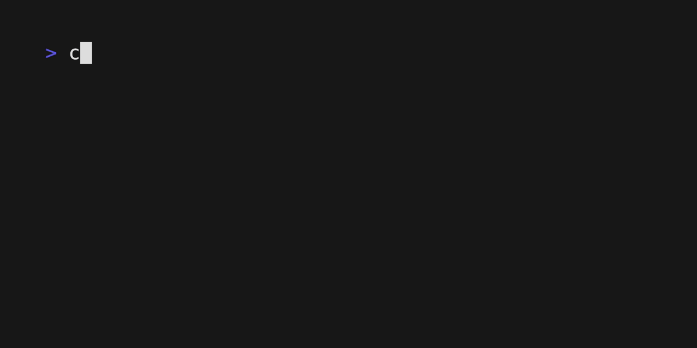

# Countdown

<p align="center">
  <br>
  
  <br>
</p>

<a href="https://webpod.dev/?from=countdown"></a>

## Install

```sh
brew install countdown
```

```sh
go install github.com/antonmedv/countdown@latest
```

Or download prebuilt binary from [releases](https://github.com/antonmedv/countdown/releases).

## Usage

Specify duration in Go format `1h2m3s` or a target time: `02:15pm`, `14:15`.

```sh
countdown 25s
countdown 11:32
```

Add a command with `&&` to run after the countdown.

```sh
countdown 1m30s && say "Hello, world"
```

Count from up from the zero.

```sh
countdown -up 30s
```

Announce (via macOS `say` command) last 10 seconds.

```sh
countdown -say 10s
```

## Key binding

- `Space`: Pause/Resume the countdown.
- `Esc` or `Ctrl+C`: Stop the countdown without running the next command.

## License

[MIT](LICENSE)
